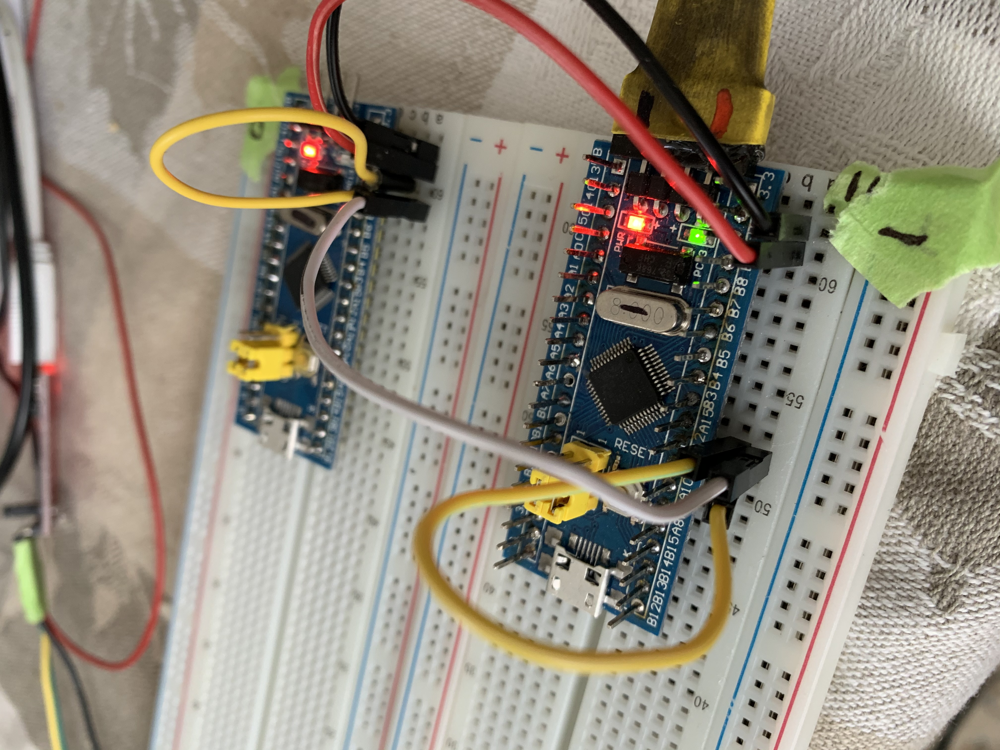
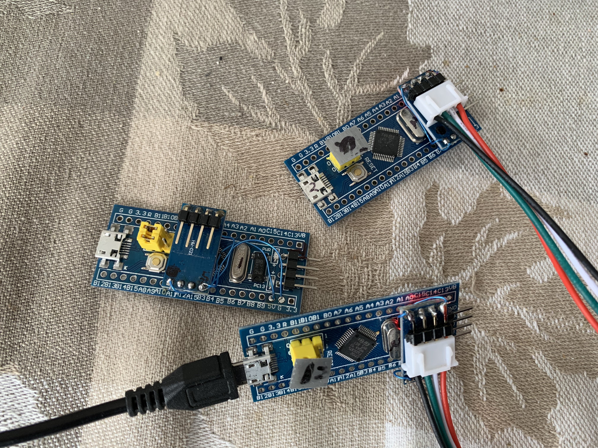

#  eXoCAN Library 

[]
<!--https://github.com/exothink/eXoCAN/assets/eXoCanXcvr.jpg 
[]
https://github.com/exothink/eXoCAN/blob/master/assets/eXoCanSingleWire.jpg
https://github.com/exothink/eXoCAN/blob/master/assets/eXoCanXcvr.jpg
-->

This is the **eXoCAN** library for the STM32F103 processor.  

Developed using the low cost 'Blue Pill' boards.
 * [eBay STM32f103 listings](https://www.ebay.com/sch/i.html?_from=R40&_trksid=m570.l1313&_nkw=stm32f103c8t6&_sacat=0&LH_TitleDesc=0&_osacat=0&_odkw=stm32f103+board)
 

<!-- START COMPATIBILITY TABLE -->

## Compatibility:

MCU                | Tested Works | Doesn't Work | Not Tested  | Notes
------------------ | :----------: | :----------: | :---------: | -----
AVR                |              |      X       |             |
STM32F103C8T6      |      X       |              |             | 
STM32F103CBT6      |      X       |              |             |
CKS32f103c8        |      X       |              |             |

  * Blue Pill boards utilize processor ICs from various foundries. The markings on the chips have no correlation to the actual silicon under the cover.  So far, the eXoCAN library works without issue on the three variants I have.
  

<!-- END COMPATIBILITY TABLE -->

# Installation:
To install, use the Arduino Library Manager and search for "eXoCAN" and install the library.  The library was developed using Platformio and STM32duino.  

## Dependencies:
 * None

# Features:
* Std and Extended IDs
* Multiple Bit Rates
* Hardware ID filtering, 32/16b, List/Masked
* Listen Only, Eavesdrop Mode
* CAN Transceiver Chip or Single Wire Hardware Bus
* Variable Data Length
* Byte, Int16, Int32 and Int64 data interface

# Examples:
* **bpCanBlink.ino**  
A minimal example that toggles an LED upon reception of a CAN Bus frame.  Using the mode 'PORTA_11_12_WIRE_PULLUP' two or more boards communicate via a single wire.

* **bpCanBlinkInterrupt.ino**   
Adds interrupts for receive.

* **eXoCanDataSim.ino**   
Simulates varying data from multiple sensors and sends data to the CAN and Serial busses.

* **eXoCanDev.ino**  
This example exercises most of the eXoCAN API. It prints the RX/TX Can frames to the Serial port.

# Notes: 
* **XCVR (external transceiver IC)**  
Commercial CAN bus integrated circuits provide the best performance and should be used when connecting to an existing CAN bus. 

    BPs with TJA1050 CAN tranceiver boards using default and alternate pins.  
  
  **Caution:**   The "SN65HVD230 CAN Bus Transceiver Communication Module For Arduino" sold on eBay do not work.  I've tried several.

* **Single wire can be used in two ways:** 

  i. With Stm32f1 weak internal pull up resistors.  This mode should only be used for development, experimentation or possibly on-board communication.  The internal pull ups are nominal 40K ohm resistors, this increases noise susceptibilty and limits speed.  

    ii. Single wire with an external pull up resistor in the range of 600 to 1000 ohms will yield better high-speed performance and noise immunity.  Although single wire may work when connected to a true differential CAN bus, it will unbalance the bus and reduce it's effectiveness.

* **Endianness**  
The default endian of the stm32f1 is little.  This may cause problems on an existing bus with data types larger than byte.  You may find the bytes of these larger types are reversed.

# Inspiration:

 * 'eXoCAN' was developed to allow the installation of smart sensors and controls in a pre-bells/whistles 1984 VW Vanagon.  

 * The Arduino framework was chosen for its ecosystem of existing sensor software.
 * The STM32F103 Blue Pill boards are ideal due to thier low cost($2.00US), processing power and integral CAN engine.
 * A big thanks goes out to [JeeLabs](https://jeelabs.org/projects/jeeh/) for the series on CAN using the STM32.  
 * [pazi88](https://github.com/pazi88/8Ch-EGT) has also done a nice job implementing ST's bxCan.

## About this Driver:
Written by John Eckert (k2ox).
BSD license, check license.txt for more information
All text above must be included in any redistribution.

